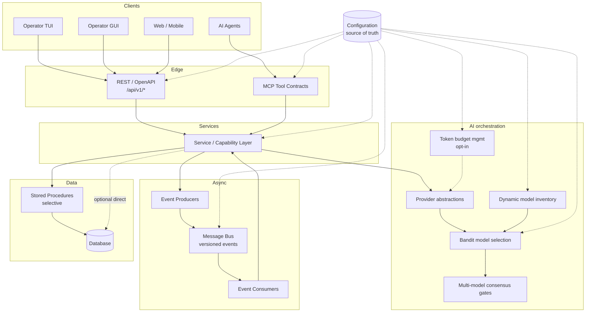

# FlossWare Reference Architecture

This document is the visual and narrative companion to the ADRs under [`adr/`](../../adr/).

## Diagram (Mermaid)

## Layers

| Layer | Role | Governing ADRs |
|-------|------|----------------|
| Clients | Operator UIs, automation, and agents | [ADR-0007](../../adr/ADR-0007-unified-client-service-contract.md), [ADR-0017](../../adr/ADR-0017-agent-neutral-architecture.md) |
| REST edge | Synchronous external contract | [ADR-0010](../../adr/ADR-0010-rest-service-boundaries.md) |
| MCP edge | Agent tool discovery/invocation | [ADR-0004](../../adr/ADR-0004-mcp-tool-contracts.md), [ADR-0018](../../adr/ADR-0018-mcp-capability-exposure.md), [ADR-0019](../../adr/ADR-0019-agent-tool-security-and-authorization.md) |
| Service / capability | Business behavior; protocol-independent | [ADR-0010](../../adr/ADR-0010-rest-service-boundaries.md), [ADR-0020](../../adr/ADR-0020-capability-protocol-separation.md) |
| AI orchestration | Provider abstraction, model inventory, routing, consensus, token budgets | [ADR-0002](../../adr/ADR-0002-ai-provider-abstraction.md), [ADR-0012](../../adr/ADR-0012-multi-model-consensus-quality-gates.md), [ADR-0013](../../adr/ADR-0013-bandit-based-model-selection.md), [ADR-0014](../../adr/ADR-0014-token-budget-management.md), [ADR-0015](../../adr/ADR-0015-dynamic-ai-model-inventory.md) |
| Message bus | Async integration; opt-in publish | [ADR-0005](../../adr/ADR-0005-event-driven-internal-bus.md), [ADR-0001](../../adr/ADR-0001-explicit-opt-in-cross-cutting-behavior.md) |
| Stored procedures | Selective data-centric logic | [ADR-0011](../../adr/ADR-0011-stored-procedure-database-access.md) |
| Database | Persistence | [ADR-0011](../../adr/ADR-0011-stored-procedure-database-access.md) |
| Configuration | Source of truth for runtime behavior | [ADR-0009](../../adr/ADR-0009-core-architecture-principles.md), [ADR-0016](../../adr/ADR-0016-configuration-as-source-of-truth.md) |

## Cross-cutting rules

- Cross-cutting behaviors (events, audit, metrics, tracing, token compression, MCP exposure) are **explicit opt-in** — [ADR-0001](../../adr/ADR-0001-explicit-opt-in-cross-cutting-behavior.md).
- Preferred mechanism when opted in: decorators / interceptors / middleware — [ADR-0006](../../adr/ADR-0006-cross-cutting-decorators.md).
- AI access goes through provider abstractions; local inference is not the default — [ADR-0002](../../adr/ADR-0002-ai-provider-abstraction.md), [ADR-0003](../../adr/ADR-0003-no-local-inference-default.md).
- Prefer free/open modular components — [ADR-0008](../../adr/ADR-0008-free-first-modular-platform.md).
- Configuration is authoritative; generated artifacts are not — [ADR-0016](../../adr/ADR-0016-configuration-as-source-of-truth.md).
- Capability before protocol; agent-neutral platform — [ADR-0020](../../adr/ADR-0020-capability-protocol-separation.md), [ADR-0017](../../adr/ADR-0017-agent-neutral-architecture.md).

## Maintainability

- Primary format: **Mermaid** in this Markdown file (renders on GitHub, editable in PRs).
- Optional: export to Draw.io / SVG for slide decks; keep this file as source of truth.

## Reference implementations

- [tftp-os client contract validation](reference-implementations/tftp-os-ui-contract.md)
